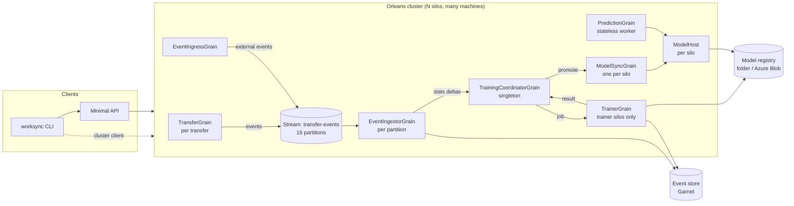

# WorkSync — transfer forecasting with ML.NET

WorkSync learns from the events emitted while files move between cloud storage providers (S3, Azure Blob, GCS,
OneDrive, Google Drive, Dropbox, Box) and predicts, for a new transfer:

| Predictor | Model (ML.NET) | What the user sees |
|---|---|---|
| **Duration** | LightGBM regression on `log(seconds)` | Expected duration, **P10–P90 range** (from holdout residual quantiles), ETA |
| **Failure risk** | LightGBM binary classifier | Probability the transfer fails |
| **Throughput** | FastTree regression on `log(bytes/s)` | Expected MB/s |
| **Slow-transfer anomaly** | Robust z-score of the duration residual (median/MAD) | "This transfer was 3.4× slower than expected" |
| **Best time to start** | Duration + failure models swept over a horizon | Top start slots and a 24-hour heatmap |

Features: provider pair, regions and their distance class, total bytes, file count, average file size, concurrency,
account tier, hour of day and day of week (UTC). Models retrain **continuously** from the event stream using a
champion/challenger policy, and every version is kept so you can roll back.

Built on .NET 10, ML.NET 5, Project Orleans 10, Garnet and (in production) Azure Storage + Redis Streams.

## Architecture



1. **Events in.** `TransferGrain` runs a (simulated) transfer and publishes `Started → Progress… → Completed/Failed`
   events. Real engines can post events to `POST /events/batch`. Events are partitioned by transfer id, so
   ordering per transfer is preserved.
2. **Ingest.** Each partition's `EventIngestorGrain` appends events to the store (idempotent, so at-least-once
   delivery is safe). On a terminal event it builds a `TransferRecord`, scores it against the current model, flags
   anomalies, and batches statistics (new records, rolling MAE, size drift) to the coordinator.
3. **Decide.** `TrainingCoordinatorGrain` (persistent state, a durable reminder plus a fast timer) retrains when:
   no model exists yet; *N* new records have arrived; the retrain interval has elapsed; rolling MAE drifts past
   `DriftMaeRatio ×` the champion's holdout MAE; or the traffic size mix shifts. A lease guarantees one run at a
   time, even if a trainer silo dies.
4. **Train.** `TrainerGrain` (only on silos with `IsTrainer=true`) reads the sliding window from the store, trains
   all models, evaluates **both** challenger and champion on the same time-based holdout, and publishes the
   challenger as a new immutable version.
5. **Promote.** The challenger is promoted only if it beats the champion under the `Promotion` policy: duration MAE must
   improve by at least 1%, and failure AUC may drop by at most 0.02. Promotion moves the registry's `current` pointer and pushes the version to every silo
   through its `ModelSyncGrain`. Each silo also polls the registry, as a safety net.
6. **Serve.** `PredictionGrain` is a stateless worker, so every silo scores locally with its in-memory model.

## Solution layout

| Project | Purpose |
|---|---|
| `WorkSync.Domain` | Providers, regions, requests, events, records, forecast DTOs |
| `WorkSync.DataGen` | Realistic synthetic workload (diurnal congestion, provider throttling, failures, drift) |
| `WorkSync.ML` | Feature engineering, `ModelTrainer`, `TransferPredictor`, evaluation, champion/challenger, best-time advisor |
| `WorkSync.Storage` | `IEventStore` (Garnet / in-memory) and `IModelRegistry` (local folder / Azure Blob) |
| `WorkSync.Streams.Redis` | Orleans persistent-stream adapter on Redis Streams (consumer groups, ack, trimming) |
| `WorkSync.Grains.Abstractions` / `WorkSync.Grains` | Grain contracts and implementations, `ModelHost`, silo-keyed placement |
| `WorkSync.Hosting` | One-line `AddWorkSyncSilo` / `AddWorkSyncClient` wiring for the Development and Production profiles, embedded Garnet, dev data seeder |
| `WorkSync.Silo` | Standalone silo host |
| `WorkSync.Api` | Minimal API (co-hosts a silo by default, or runs as a client) |
| `WorkSync.Cli` | `worksync` command-line tool (offline ML + cluster control) |
| `tests/*` | ML unit tests, a 2-silo in-process cluster test, storage contract tests, API tests |

## Quick start (single process)

```powershell
dotnet run --project src\WorkSync.Api
```

In Development the API co-hosts a silo, starts an embedded Garnet on port 6380, seeds 4,000 synthetic transfers
and trains model v1 (a few seconds). Then:

```powershell
$req = @{ sourceProvider='S3'; sourceRegion='UsEast'; destinationProvider='AzureBlob'; destinationRegion='EuWest';
          totalBytes=50GB; fileCount=12000; concurrency=8; tier='Standard' }
Invoke-RestMethod http://localhost:5080/predict -Method Post -ContentType application/json -Body ($req | ConvertTo-Json)
```

The OpenAPI document is at `/openapi/v1.json`.

| Endpoint | Description |
|---|---|
| `POST /predict[?startAt=]` | Duration (P10–P90), ETA, failure probability, throughput |
| `POST /predict/best-time` | `{ request, from?, horizonHours=168, top=5, failurePenalty=2 }` → best slots + heatmap |
| `POST /predict/anomaly` | Score a finished `TransferRecord` |
| `POST /transfers`, `GET /transfers/{id}` | Start a simulated transfer; live progress, ETA, anomaly verdict |
| `POST /events/batch` | Ingest events from a real transfer engine |
| `GET /models`, `GET /models/current`, `POST /models/{v}/rollback` | Registry and rollback |
| `GET /training/status`, `POST /training/run?reason=` | Retraining state and history; manual trigger (409 if busy) |

Errors are RFC 7807 problem details: `503` + `Retry-After` until a model exists, `400` for invalid input, `404` for
unknown versions or transfers.

## Multi-silo (local)

```powershell
dotnet run --project src\WorkSync.Silo                                         # primary: trainer, embedded Garnet
dotnet run --project src\WorkSync.Silo --launch-profile "Silo2 (dev, joins primary)"  # 2nd silo, not a trainer
dotnet run --project src\WorkSync.Api --launch-profile "http (client of external silos)"   # API as a cluster client
```

## CLI

```text
worksync [--registry <dir>] <command>

Offline (works on CSV files and a local model folder):
  datagen   -o data.csv [-n 20000] [--days 30] [--seed 42] [--drift "Dropbox=0.5"]
  train     --data data.csv [--force]          # publish; promote only if it beats the champion
  evaluate  --data data.csv [--version N]
  predict   -s S3 --source-region UsEast -d Dropbox --dest-region EuWest --size 25GB --files 4000 [--start <time>]
  best-time <same transfer options> [--horizon 168] [--top 5]
  models list | models rollback <version>

Cluster (connects as an Orleans client; Development → localhost gateway 30000):
  cluster status | cluster train [--reason ...] | cluster rollback <version>
  cluster simulate [-n 20000] [--rate 20] [--seed 42] [--drift "Dropbox=0.4"]
```

Try continuous retraining against drift: run the API, then
`worksync cluster simulate -n 3000 --rate 200 --drift "Dropbox=0.4"` and watch `worksync cluster status`. The drift
triggers fire, a challenger is trained, and it is promoted if it is better.

## Configuration

All settings live under the `WorkSync` section (appsettings, environment variables such as
`WorkSync__EventStore__Kind`, or the command line).

| Key | Default | Notes |
|---|---|---|
| `Profile` | `Development` | `Development` = localhost clustering, in-memory grain state/reminders/streams. `Production` = Azure Table clustering/state/reminders + Redis Streams |
| `ClusterId`, `ServiceId` | `worksync-dev`, `worksync` | |
| `Silo:SiloPort`, `Silo:GatewayPort` | 11111, 30000 | |
| `Silo:PrimarySiloEndpoint` | — | Dev only: endpoint of the first silo, for additional silos |
| `Silo:IsTrainer` | `true` | Only trainer silos run `TrainerGrain` |
| `EventStore:Kind` | `Garnet` | `Garnet` or `InMemory` |
| `EventStore:Embedded` / `EmbeddedPort` | `true` / 6380 | Start Garnet in-process; otherwise use `ConnectionString` (Garnet or Redis) |
| `Registry:Kind` | `LocalFolder` | `LocalFolder` (`Path`, default `%LOCALAPPDATA%\WorkSync\models`) or `AzureBlob` (`BlobConnectionString`, `BlobContainer`) |
| `Azure:StorageConnectionString` | — | Required in Production |
| `Streams:RedisConnectionString`, `QueueCount`, `MaxStreamLength` | —, 8, 200000 | Production stream transport |
| `Seed:Records`, `Seed:Days` | 4000, 30 | Dev seeding when the store is empty (0 disables it) |
| `Grains:TrainingWindow` | 30 days | Sliding training window |
| `Grains:RetrainAfterNewRecords` / `RetrainInterval` | 1000 / 6 h | Volume and schedule triggers |
| `Grains:DriftMaeRatio` / `DriftMeanLogBytesShift` / `DriftMinimumSamples` | 1.35 / 1.0 / 200 | Drift triggers |
| `Grains:Training:*` | | `Iterations`, `MinimumRecords`, `AnomalyQuantile`, … |
| `Grains:Promotion:MinDurationImprovement` / `MaxAucRegression` | 0.01 / 0.02 | Champion/challenger thresholds |
| `Grains:SimulationTimeCompression` | 3600 | Simulated transfers run this many times faster than real time |

### Production deployment

Set `WorkSync:Profile=Production` and provide `Azure:StorageConnectionString`, `Streams:RedisConnectionString`,
`EventStore:Embedded=false` with `EventStore:ConnectionString` (a shared Garnet or Redis), and
`Registry:Kind=AzureBlob`. Run any number of `WorkSync.Silo` instances (mark one or more with `Silo:IsTrainer=true`)
and API nodes, which either co-host silos or run as clients (`Api:CoHostSilo=false`). Replace
`SimulatedTransferExecutor` with a real `ITransferExecutor`, or feed real events through `/events/batch`.

## Design notes

- **Bundle versioning.** Duration, failure, throughput and anomaly calibration are trained and versioned together,
  so a forecast is always internally consistent.
- **Model distribution.** Orleans broadcast channels don't fan out per silo, so promotion calls a silo-keyed
  `ModelSyncGrain` on every host, and each silo also polls the registry.
- **Anomaly detection.** A robust residual z-score was chosen over unsupervised PCA. It explains itself ("3× slower
  than expected") and adapts with every retrain.
- **Time-aware evaluation.** Holdout sets are the most recent slice of the window, and the champion is re-scored on
  that same slice, so the comparison is fair under drift.

## Tests

```powershell
dotnet test --project tests\WorkSync.ML.Tests
dotnet test --project tests\WorkSync.Grains.Tests   # 2-silo cluster + Garnet/in-memory store + registry
dotnet test --project tests\WorkSync.Api.Tests
```
